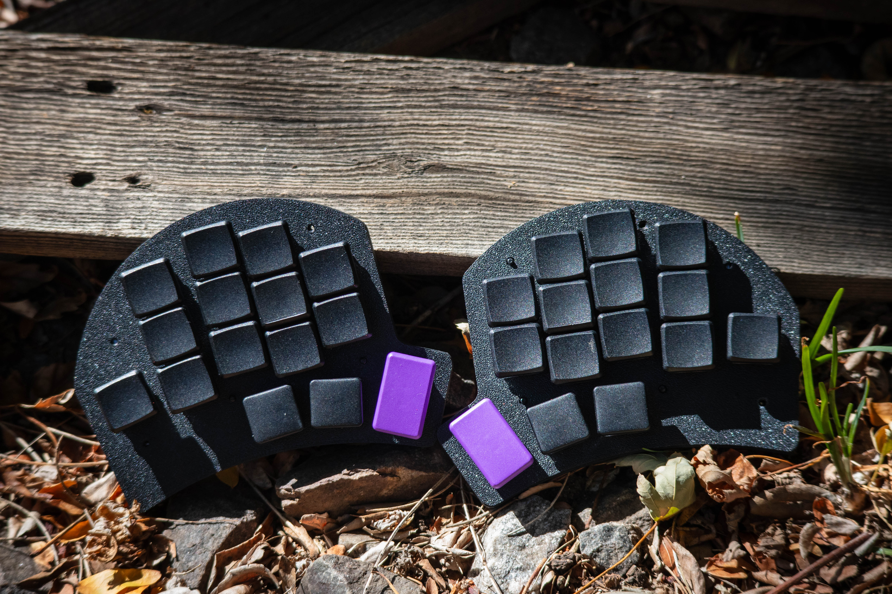
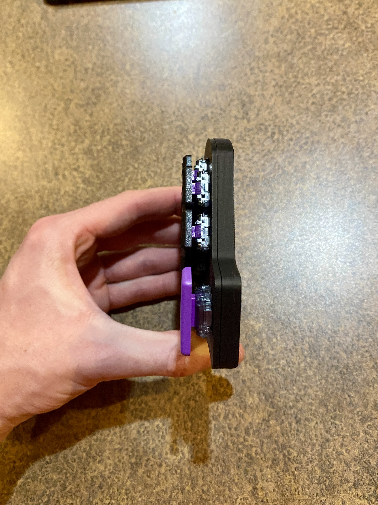
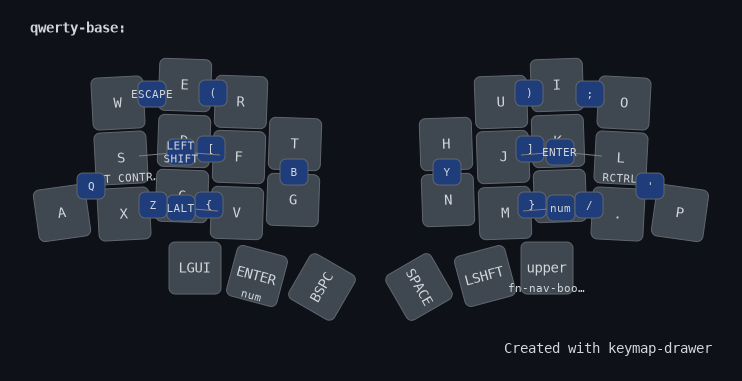
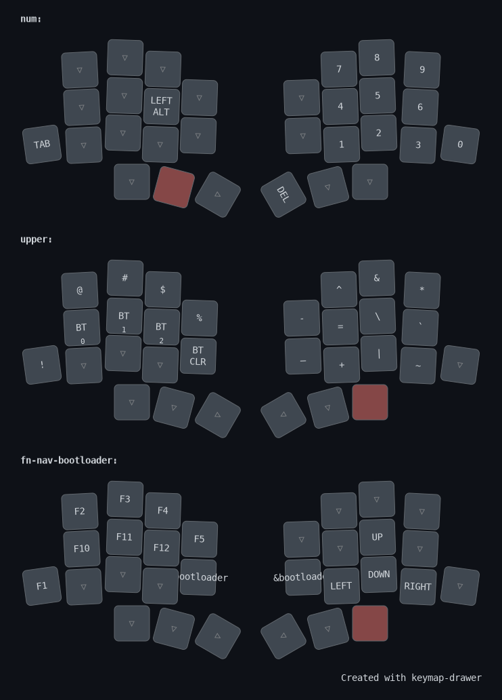

# Eden

Eden is a 30 key split keyboard.

Features
- Choc spacing/ hotswap
- 3 key thumb cluster
- Decent splay
- 2 inner keys and 1 pinky key
- Hand wire hotswap
- Diodeless

 

The board is quite thin

    

The board is diodeless, meaning you have to connect each hotswap to GND and a GPIO pin.\\
This means that the wiring for the board can get a little messy.

    

I used a mix of hotglue and super glue to hold the microcontroller in place.

---
### Layout

 
Having 6 missing alpha keys means that you need to find a place for 3 keys on each half. I achived this by putting 1 on a combo between the 2 inner keys, and 1 on the pinky and top ring key. For the right side, it is less important for these keys to be ergonomic, because they are not used while fast typing often. So they are just on combos with the middle and ring keys (although I do find this very comfortable in normal typing).

 
The rest of the layers are just normal, with a numpad like thing on the right side for the numbers. And a slightly modified version of the "upper" layer from my normal 36key layout. There is the fn-nav-bootloader layer that has some common FN keys, keys to put the MCUs into their bootloader mode, to flash new firmware (because this keyboard does not have physical reset buttons), and then some arrow keys under the right hand.
 
The only thing I had to sacrifice, other than 3 keys on each half, was the double arrow key setup that I have on my normal 36key layout. Meaning I can't use both of my thumbs to access a layer that has arrows on them.
